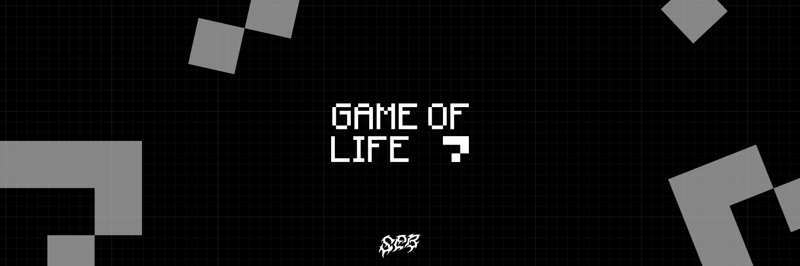

# Conway's Game Of Life



Welcome to the "Game of Life" project, developed using React. This project implements the cellular automaton known as the "Game of Life", invented by mathematician John Horton Conway.

# Table of Contents

1. Project Overview
2. Features
3. Prerequisites
4. Installation
5. Usage
6. Project Structure


# Project Overview
[](https://fr.react.dev/)
[](https://wikipedia.org/wiki/JavaScript)
[](https://www.npmjs.com/)
[](https://vercel.com)


The "Game of Life" is a cellular automaton where cells live or die based on simple rules. This project uses React for the user interface and Vite for bundling, offering a fast and modern development experience.

# Features
- Infinite Board: The canvas has no borders, cells can live anywhere.
- Zoom & Pan: Wheel or pinch to zoom, right click / space + drag / two fingers to move around.
- Interactive Grid: Click or drag to toggle cell states (alive or dead).
- Start/Pause: Control the evolution of the grid with start and pause buttons.
- Adjustable Speed: Change the speed of the generation evolution.
- Reset: Reset the grid to its initial state.

## Controls

| Action | Mouse / keyboard | Touch |
| --- | --- | --- |
| Draw or erase cells | left click, drag to paint | one finger (draw mode) |
| Move the world | right click drag, space + drag, arrow keys, or "move" mode | one finger (move mode), two fingers |
| Zoom | wheel, `+` / `-` keys, zoom buttons | pinch |
| Back to the origin at 100% | `0` key or the zoom percentage button | zoom percentage button |

# Prerequisites

- Node.js 22.12 or higher (24 LTS recommended — see `.nvmrc`, run `nvm use`)
- npm or yarn

# Installation

1. Clone the repository:

```bash
git clone https://github.com/rochesebastien/game-of-life.git
# ---
cd game-of-life
```

2. Install dependencies:
```bash
npm install
# or 
yarn install
```

# Usage
Start the development server:


```bash
npm run dev
# or
yarn dev
```
Open your browser and go to http://localhost:5173.

# Project Structure
```
game-of-life/
├── public/                 # Static files (images/icons/audio)
├── src/
│   ├── components/                                # React components
│   │   │   ├── Component                          # Component folder
│   │   │   │   │── Component.jsx                  # Component JSX file
│   │   │   │   │── Component.css                  # Component CSS file
│   │   │   ├── ...                                # ...
│   ├── pages/                                     # Pages folder
│   │   │   ├── Page                               # Page folder
│   │   │   │   │── Page.jsx                       # Page JSX file
│   │   │   │   │── Page.css                       # Page CSS file
│   │   │   ├── ...                                # ...
│   ├── styles/                                    # Basic CSS styles
│   ├── App.jsx                                    # Layout Rooter
│   ├── main.jsx                                   # Application entry point
├── index.html                                     
├── vite.config.js                                 
├── package.json                                   # Node Dependencies
└── README.md             
```

---
2024 - Roche Sébastien
